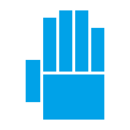
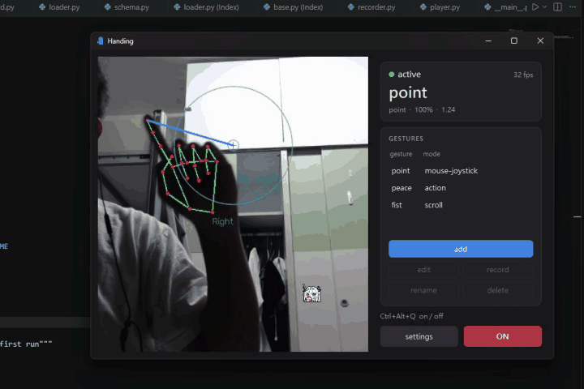
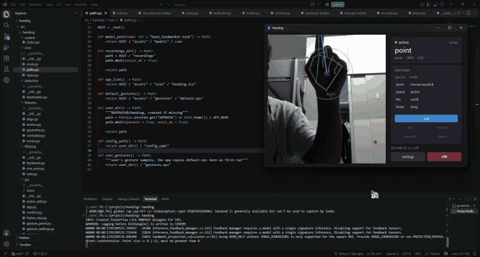
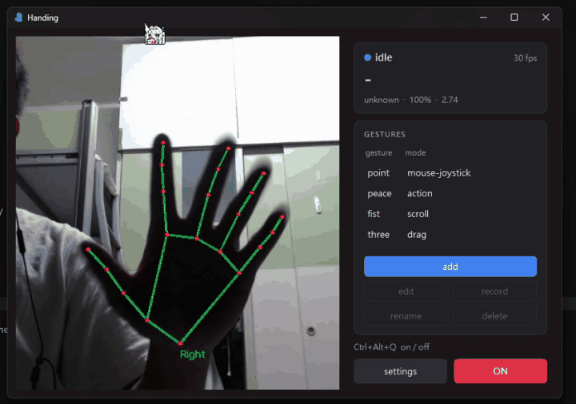
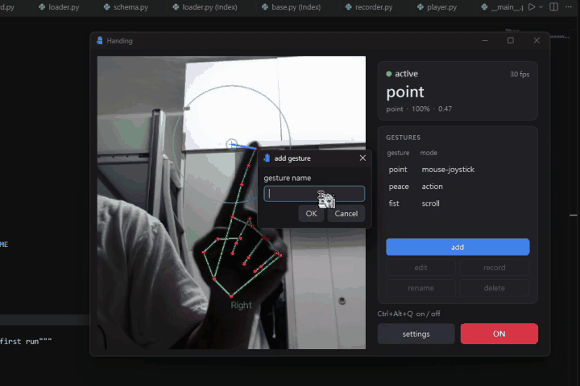

<p align="center">
  
</p>

<h1 align="center">Handing</h1>

<b><p align="center">Control your Windows PC with hand gestures and a webcam.</p></b>

Handing runs in the system tray.  
It watches your hand through an ordinary webcam and turns the gestures you teach it into mouse movement, clicks, scrolling, key presses and macros.  
You can lean back while you watch videos, scroll Reels or read, and still control the PC without reaching for the mouse or keyboard.

## Demo

| Move the cursor | Drag a window |
|---|---|
|  |  |
| **Click** | **Custom gesture** |
|  |  |

## Features

- **Custom gestures.** Record a few seconds of any hand pose and give it a name. Recognition uses k-nearest neighbours on the hand's shape, so no training step or GPU is needed.
- **Modes per gesture.**

  | Mode | What it does |
  |---|---|
  | `mouse` | Moves the cursor. The `relative` style works like a touchpad. The `joystick` style works like a stick: the farther you push from a center circle, the faster the cursor moves. |
  | `drag` | Holds the left button while you move. |
  | `scroll` | Moves your hand up or down to turn the mouse wheel. |
  | `trigger` | Fires an action when you swipe left, right, up or down. |
  | `action` | Runs a key combo, a click or a macro, once or repeatedly while you hold the gesture. |
  | `lock` | Pauses control until you show the unlock gesture. |

- **Left and right hand.** A gesture can do something different on each hand (`fist@left`, `fist@right`), and you can limit control to one hand.
- **Macros.** Chain key taps, holds, typed text, waits, clicks, moves and scrolls.
- **Rotation alignment** (optional). Turns poses upright before comparing them, so a gesture still matches when you tilt your hand. Handing warns you when this would merge two of your gestures.
- **Stable output.** A hysteresis filter stops brief misreads from switching gestures, and a One Euro filter keeps the cursor smooth without lag.
- **Safety.**
  - Output starts **off**. Press `Ctrl+Alt+Q` to turn it on or off. The same hotkey is the emergency stop: it also cancels running macros and releases any held keys or buttons.
  - You can set Handing to lock itself when no hand is seen for a while.
- **Lightweight.** A typical PC runs at about 28 fps, with about 7 ms per detection, about 1% CPU and about 155 MB of RAM. When no hand is in view, Handing lowers its frame rate.

## Install

### Release build

1. Download `Handing-<version>-win64.zip` from [Releases](https://github.com/Neoxy-6/Handing/releases).
2. Unzip it anywhere.
3. Run `Handing.exe`. No Python is needed.

### From source

Requires Python 3.10 or later on Windows.

```powershell
git clone https://github.com/Neoxy-6/Handing.git
cd Handing
python -m venv .venv
.venv\Scripts\pip install -e .
.venv\Scripts\handing
```

## Usage

1. Start Handing. The preview shows the camera image and the hand landmarks.
2. Press `Ctrl+Alt+Q` to turn output on.
3. The default gestures:

   | Gesture | Mode |
   |---|---|
   | `point` | Moves the cursor with the joystick style, following the index fingertip. |
   | `fist` | Scrolls. |
   | `peace` | Left click. |

4. To make a new gesture, click **add**, name it, and hold the pose while it records. Then click **edit** to choose its mode.
5. Minimizing the window hides it to the tray. Closing the window quits Handing.

Settings are saved in `%APPDATA%\Handing\config.yaml`, and your gesture samples in `%APPDATA%\Handing\gestures.npz`.

## Future Outlook

- **Gamepad mode.** Both hands become a virtual Xbox controller through ViGEmBus. Hand positions drive the two sticks, and gestures press the buttons and triggers.
- **VR mode.** Both hands become SteamVR controllers through VMT. It works without a headset by using SteamVR's null driver.
